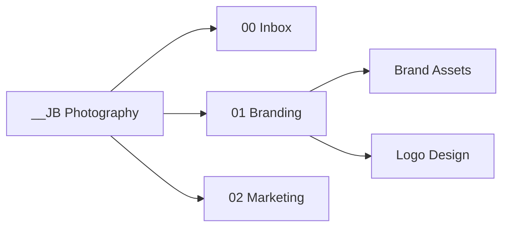

# folder_structure_visualizer

Generate a living map of a local folder structure as plain text, Markdown, Mermaid, optional SVG/PNG images, and an interactive HTML viewer.

This tool is built for documenting real working folders, especially personal and business systems such as photography folders, client delivery folders, creative archives, and project directories.

## Why It Exists

Folder systems drift. A quick visual map makes it easier to understand what exists, explain a workflow, clean up old areas, and keep documentation current without manually rebuilding tree diagrams.

## Installation

From this project directory:

```bash
python -m pip install -e ".[dev]"
```

This installs the `folderviz` command and the test dependencies.

## Usage

Generate the default outputs in the current directory:

```bash
python -m folder_structure_visualizer --root "~/Documents/__JB Photography"
```

The installed command works too:

```bash
folderviz --root "~/Documents/__JB Photography"
```

Limit depth and write outputs into a chosen folder:

```bash
python -m folder_structure_visualizer \
  --root "~/Documents/__JB Photography" \
  --output-dir "~/Documents/__JB Photography/00 Inbox" \
  --max-depth 3 \
  --formats tree,markdown,mermaid
```

Generate Markdown, Mermaid, and an SVG if Mermaid CLI is installed:

```bash
python -m folder_structure_visualizer \
  --root "~/Documents/__JB Photography" \
  --formats markdown,mermaid,svg \
  --color-by-depth
```

Generate an interactive viewer with zoom controls and drag-to-pan:

```bash
python -m folder_structure_visualizer \
  --root "~/Documents/__JB Photography" \
  --formats markdown,mermaid,html \
  --color-by-depth
```

## CLI Options

```text
--root                 Required. Directory to scan. Supports ~ expansion.
--annotations          Optional JSON map of root-relative paths to node descriptions.
--output-dir           Optional. Defaults to current working directory.
--name                 Optional document title. Defaults to root folder name.
--max-depth            Optional integer. Root is depth 0.
--include-files        Include files as leaf nodes. Defaults to folders only.
--include-hidden       Include hidden files/folders. Hidden names are ignored by default.
--include-archives     Include archive-like folders. Archives are ignored by default.
--ignore               Repeatable case-insensitive substring ignore.
--formats              Comma-separated formats. Defaults to tree,markdown,mermaid.
--color-by-depth       Add Mermaid classes and colors based on folder depth.
--mermaid-direction    Mermaid graph direction: LR or TD. Defaults to LR.
```

Allowed formats:

```text
tree, markdown, mermaid, svg, png, html
```

Generated files use stable names and are overwritten on repeat runs:

```text
structure.txt
structure.md
structure.mmd
structure.svg
structure.png
structure.html
```

## Semantic Node Annotations

Use an annotation file to add one concise explanation to any directory or file node. Keys are paths relative to the scanned root; use `.` for the root itself:

```json
{
  ".": "Project root and top-level configuration.",
  "src": "Application source code.",
  "src/folder_structure_visualizer": "Importable package and rendering pipeline.",
  "tests": "Automated behavior and regression checks."
}
```

Pass the file when generating a visualization:

```bash
folderviz \
  --root . \
  --annotations examples/annotations.json \
  --include-files \
  --formats tree,markdown,mermaid,html
```

Descriptions appear beside node names in text and Markdown trees and beneath node names in Mermaid, SVG, PNG, and HTML diagrams. The annotations remain separate from the scanned directory, allowing explanations to be reviewed and updated without renaming folders or modifying their contents.

When `--annotations` is supplied, the scanner checks every rendered node for a description. Any omitted root-relative path is reported as `Missing semantic annotation: <path>` in terminal output and in the Markdown warnings section. This makes incomplete semantic coverage visible instead of silently producing unexplained nodes.

If `svg`, `png`, or `html` is requested, `structure.mmd` is generated as the source diagram even when `mermaid` is not listed. The HTML viewer embeds `structure.svg`, so Mermaid CLI is required for `html`.

## Example Output

Plain text tree:

```text
__JB Photography
├── 00 Inbox
├── 01 Branding
│   ├── Brand Assets
│   └── Logo Design
└── 02 Marketing
```

Mermaid:



## Mermaid Image Rendering

SVG and PNG rendering uses Mermaid CLI if it is available:

```bash
npm install -g @mermaid-js/mermaid-cli
```

If Mermaid CLI is missing, the tool still writes `structure.mmd` and prints:

```text
Mermaid CLI not found. Install it with: npm install -g @mermaid-js/mermaid-cli
```

## Recommended Folder Workflow

Run the visualizer after major folder changes, archive cleanup, or project onboarding. Keep `structure.md` near your working documentation, and use `--max-depth` to create a readable overview before generating deeper maps.

For business folders, a practical default is:

```bash
folderviz \
  --root "~/Documents/__JB Photography" \
  --max-depth 3 \
  --formats tree,markdown,mermaid
```

Broad folder trees are easier to read with the default left-to-right Mermaid layout. To use a top-down graph instead:

```bash
folderviz \
  --root "~/Documents/__JB Photography" \
  --max-depth 3 \
  --formats mermaid,svg \
  --mermaid-direction TD
```

## Development

Run tests:

```bash
python -m pytest
```
